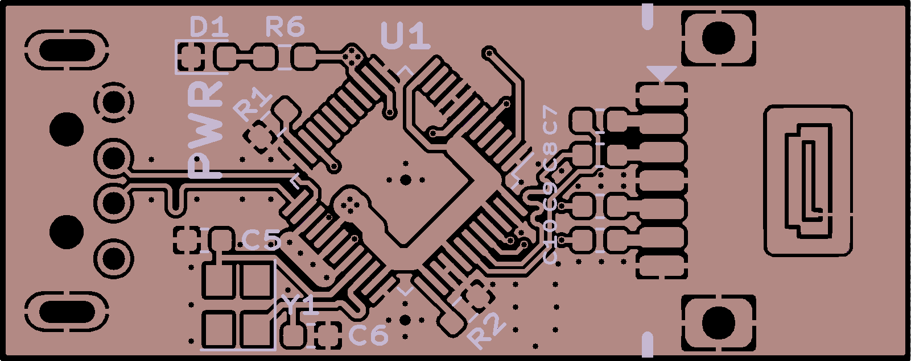

# USB SATA Stick

The USB SATA Stick converts USB 2.0 to SATA to provide a harddrive connection to things with only USB. It takes advantage of Genisys Logic's GL830, which reguires no external voltage regulators to provide a SATA connetion. No power source for the peripherial is provided and is left as a project for the user.

### [Schematic](docs/usb-sata-v1.0r1.pdf)
### [Gerbers]()